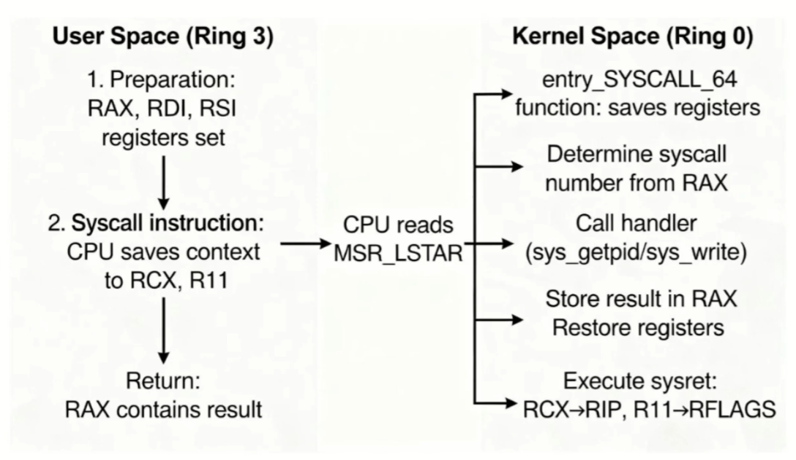
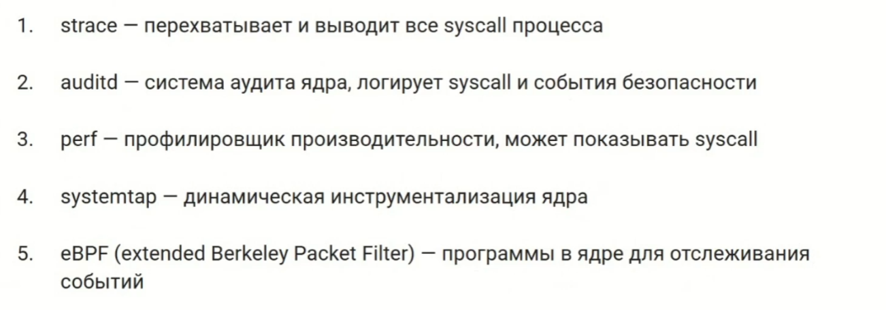

X86

# Ring

Процессор может раб. в 2 режимах

* User mode (Ring 3): непривилегированный реж., обычные приложения
* Kernel mode (Ring 0): привелиг. режим, ядро, можно обращаться к оборудованию

# syscall

* контролиуемый способ для user space приложений, получить доступ к ресурсам ядра
* единственный безоп. мех. перекл. из user space в kernel space
* api - между приложением и ядром

например read, write, open, fork ...

# Переключение user->kernel

### 1. подготовка аргументов

положить в регистры и на стек

### 2. вызов syscall

исполнение инструкции syscall

1. CPU сохраняет контекст
   1. адрес возрата в RCX
   2. RFLAGS в R11
2. Переключение привилегий
   1. Ring 3 -> Ring 0
3. загрузка адреса kernel-обработчика
   1. из Model-Specific Registr (MSR) MSR_LSTAR (может быть несколько регистров), ядро linux кладет адрес обработчика при запуске системы
   2. на x86_64 в linux kernel - entry_SYSCALL_64

### entry_SYSCALL_64

Функция-обработчик в linux на x86_64, наход. в ядре (arch/x86/entry/entry_64.S)

* сохранить контекст
* определить syscall по RAX
* найти обработчик в таблице syscall
* вызвать обработчик (напри sys_getpid() для 39)
* востановить контекст и вернуться в user space (sysret/sysretq)

# Перехват syscall

# Память

Каждый процесс имеет в вверху своего виртуального адрессного пространства отображения kernel space и kernel stack
